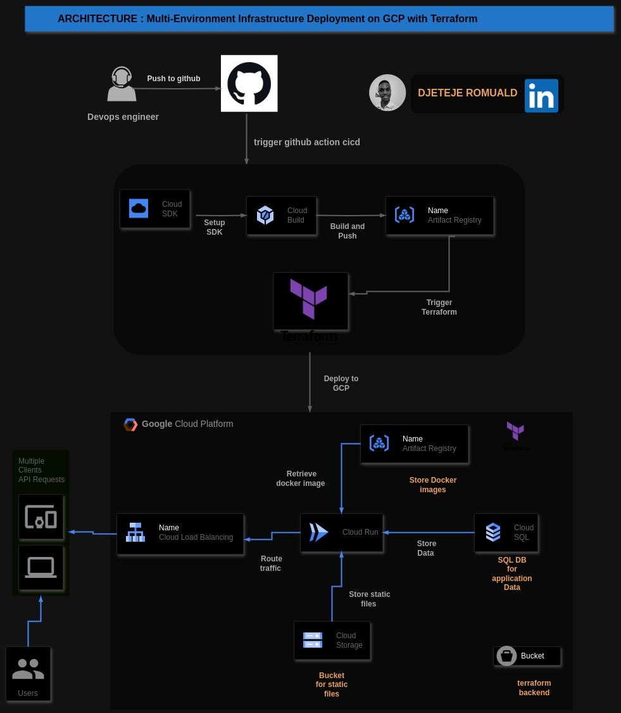

# Déploiement d'Infrastructure Multi-Environnement sur GCP avec Terraform

Ce dépôt contient les configurations Terraform pour déployer une application PHP-FPM sur Google Cloud Platform (GCP) en utilisant Cloud Run, Cloud SQL, Cloud Storage, Cloud Build et un équilibreur de charge HTTP(S). La configuration supporte les environnements de développement et de production.

## Architecture :


## Configuration du Projet et Fonctionnalités

### 1. Prérequis

Avant de commencer, assurez-vous d'avoir installé et configuré les outils suivants :

- **Google Cloud SDK** : Installez le Google Cloud SDK et authentifiez-vous sur votre compte GCP.
- **Terraform** : Installez Terraform v1.4.6 ou une version plus récente.
- **Projet Google Cloud** : Assurez-vous d'avoir un projet GCP avec la facturation activée.
- **Clé de Compte de Service** : Obtenez une clé de compte de service au format JSON avec des permissions pour Cloud Run, Cloud SQL, Cloud Storage, et le Load Balancing.

### 2. Configuration des Variables d'Environnement pour Terraform

Terraform nécessite des variables d'environnement spécifiques pour un déploiement sécurisé et adapté à l'environnement. Voici les variables à exporter :

```bash
export GOOGLE_CLOUD_PROJECT=<votre-id-de-projet-gcp>
export GOOGLE_APPLICATION_CREDENTIALS="/chemin/vers/votre/cle-de-compte-de-service.json"
export TF_VAR_region=<region-gcp>
```

Remplacez `<votre-id-de-projet-gcp>`, `/chemin/vers/votre/cle-de-compte-de-service.json`, `<region-gcp>` par vos valeurs réelles.

### 3. Exécution de la Configuration Terraform

Pour déployer l'infrastructure :

1. Naviguez dans le repertoire de l'environnement  :

    ```bash
    cd terraform-deployments/environments/<prod|dev>
    ```
     Remplacez `<dev|prod>` par l'environnement approprié.
2. **Initialiser Terraform** : Exécutez la commande suivante pour initialiser le projet :
    ```bash
    terraform init
    ```

3. **Planifier le Déploiement** : Examinez les changements d'infrastructure planifiés :

    ```bash
    terraform plan
    ```

4. **Appliquer la Configuration** : Déployez l'infrastructure :

    ```bash
    terraform apply
    ```


### 4. Accéder à l'Application Déployée

Une fois le déploiement réussi, récupérez l'URL du service Cloud Run :

```bash
gcloud run services describe <nom-du-service> --region <region> --format 'value(status.url)'
```

Naviguez vers l'URL pour accéder à votre application.

### 5. Exécution du Script Bash pour Récupérer l'Adresse IP Publique

Si vous avez besoin de récupérer l'adresse IP publique de l'équilibreur de charge :

```bash
bash scripts/get_cloud_run_ip.sh <prod|dev>
```

Ce script affichera l'adresse IP publique de votre équilibreur de charge HTTP(S).

### 6. Résolution des Problèmes Potentiels

- **Problème : Échec d'Authentification**
  - **Solution** : Assurez-vous que votre variable d'environnement `GOOGLE_APPLICATION_CREDENTIALS` pointe vers le fichier JSON correct du compte de service et qu'il dispose des permissions nécessaires.

- **Problème : Délai d'Expiration lors de l'Application de Terraform**
  - **Solution** : Cela peut se produire en raison de problèmes réseau ou de délais de provisionnement des ressources. Relancez la commande `terraform apply` après une courte attente.

- **Problème : Échec du Déploiement de Cloud Run**
  - **Solution** : Vérifiez le Dockerfile et la configuration PHP-FPM pour vous assurer que l'application se construit correctement.

### 7. Fonctionnalités Additionnelles pour un Environnement Prêt pour la Production

Pour un environnement prêt pour la production, envisagez d'implémenter les éléments suivants :

- **Monitoring** : Intégrez Stackdriver Monitoring pour suivre les performances de l'application et l'état de l'infrastructure.
- **Configurations de Sécurité** :  Activez Cloud Armor pour la protection contre les attaques DDoS.
- **Sauvegarde et Restauration** : Configurez des sauvegardes automatiques pour Cloud SQL et Cloud Storage, garantissant une préparation à la reprise après sinistre.

### 8. Problèmes Rencontrés et Solutions

- **Gestion de l'État avec Terraform** : Rencontré des problèmes de verrouillage de l'état lors de la gestion de plusieurs environnements. La solution a été d'implémenter un stockage d'état à distance dans GCS avec verrouillage activé via une configuration backend.
- **Permissions Cloud Run** : Confronté à des erreurs de permissions lors du déploiement du service Cloud Run. Ceci a été résolu en attribuant les rôles `Cloud Run Admin` et `Storage Admin` au compte de service utilisé par Terraform.
